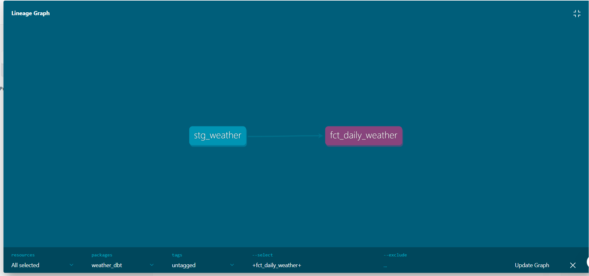

# Weather ELT Pipeline

An end-to-end ELT (Extract, Load, Transform) data pipeline that pulls live weather
data from a public API, loads it into a warehouse, and transforms it into clean,
tested, analytics-ready tables using dbt.

Built as a hands-on project to demonstrate the core skills of a modern data
engineering stack: API extraction, warehouse loading, SQL-based transformation,
automated data quality testing, and CI.

## Architecture
Open-Meteo API → Python (requests + pandas) → DuckDB (raw layer)
↓
dbt staging model (cleaning)
↓
dbt mart model (daily aggregates)

- **Extract**: `extract.py` calls the free [Open-Meteo](https://open-meteo.com/) API
  for hourly weather data and saves it as a raw CSV.
- **Load**: `load.py` loads that raw CSV into a DuckDB warehouse (`warehouse.duckdb`),
  under a `raw` schema.
- **Transform**: a dbt project (`weather_dbt/`) builds:
  - `stg_weather` — a staging model that cleans and renames raw columns
  - `fct_daily_weather` — a mart model that aggregates hourly data into daily
    averages, maxes, and totals
- **Test**: dbt tests enforce data quality — no missing timestamps, no duplicate
  timestamps, no missing temperature readings.

## Lineage



## Tech stack

- **Python** — `requests`, `pandas` for extraction
- **DuckDB** — lightweight embedded analytical warehouse
- **dbt** (`dbt-duckdb`) — SQL-based transformation, testing, and documentation
- **GitHub Actions** — CI, re-running the pipeline and tests on every push

## How to run it locally

```bash
# 1. Set up environment
python -m venv venv
venv\Scripts\activate        # Windows
pip install -r requirements.txt

# 2. Extract + load
python extract.py
python load.py

# 3. Transform + test
cd weather_dbt
dbt run
dbt test

# 4. (Optional) Browse the docs + lineage graph
dbt docs generate
dbt docs serve
```

## What I'd change for a production version

- Swap DuckDB for a cloud warehouse (Snowflake / BigQuery) for scale and
  multi-user access
- Add Airflow (or Dagster) to schedule and orchestrate the extract → load → dbt
  flow instead of running scripts manually
- Add incremental dbt models instead of full rebuilds, for larger datasets
- Add alerting on pipeline or test failures

## What I learned

Built this project to practice the ELT pattern used by most modern data teams —
in particular, structuring transformations as layered, tested, documented dbt
models rather than one-off SQL scripts.
